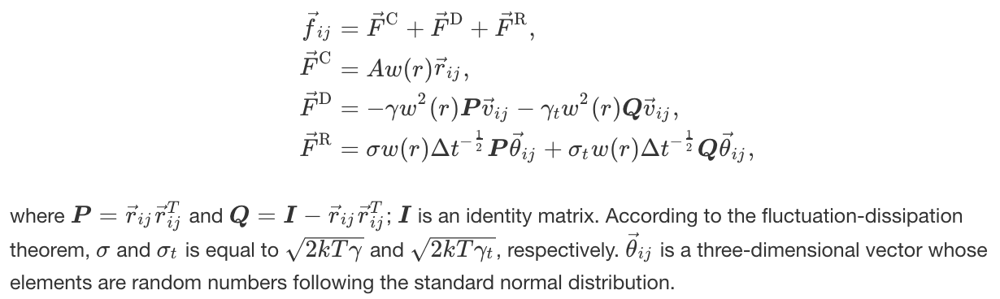

## Transverse DPD

### Correspondence with existing files

* `pair_dpd_trans.h` - `pair_dpd.h`
* `pair_dpd_trans.cpp` - `pair_dpd.cpp`
* `pair_dpd_trans_tstat.h` - `pair_dpd_tstat.h`
* `pair_dpd_trans_tstat.cpp` - `pair_dpd_tstat.cpp`
* `random_ziggurat.h` - `random_mars.h`
* `random_ziggurat.cpp` - `random_mars.cpp`

### `pair_dpd_trans`

#### Syntax

```
pair_style dpd/trans T cutoff seed
pair_coeff type1 type2 A gamma gamma_t cutoff_pair
```

* `T`: temperature (temperature units)
* `cutoff`: global cutoff for DPD interactions (distance units)
* `seed`: random number seed (positive integer)
* `A`: amplitude of conservative force (force units)
* `gamma`: friction coefficient (force/velocity units)
* `gamma_t`: friction coefficient in transverse direction (force/velocity units)
* `cutoff_pair`: cutoff of each pair (distance units)

#### Expression



### `pair_dpd_trans_tstat`

#### Syntax

```
pair_style dpd/trans/tstat Tstart Tstop cutoff seed
pair_coeff type1 type2 gamma gamma_t cutoff
```

* `Tstart,Tstop`: desired temperature at start/end of run (temperature units)
* `cutoff`: global cutoff for DPD interactions (distance units)
* `seed`: random number seed (positive integer)
* `gamma`: friction coefficient (force/velocity units)
* `gamma_t`: friction coefficient in transverse direction (force/velocity units)
* `cutoff_pair`: cutoff of each pair (distance units)

#### Expression

Same with `pair_dpd_trans` except for absence of the conservative term.

### `random_ziggurat`

Random number generator:

* Generates a random number following the standard normal distribution.
* Uses [Xorshift method](https://en.wikipedia.org/wiki/Xorshift) to generate a 32-bit integer, and then [Ziggurat method](https://en.wikipedia.org/wiki/Ziggurat_algorithm) to generate (determine) a random number following the standard normal distribution from the integer.
* Faster than [Marsaglia polar method](https://en.wikipedia.org/wiki/Marsaglia_polar_method), which is used for `pair_dpd` and `pair_dpd_tstat`.
  * Even for *standard* DPD, `pair_dpd_trans`/`pair_dpd_trans_tstat` with setting `gamma_t` to zero runs faster than `pair_dpd`/`pair_dpd_tstat`.

## Tally computing for pair/hybrid/overlay

Difference of `pair/hybrid/overlay/tally` from `pair/hybrid/overlay` is how to use `pair_modify`.
For `pair/hybrid/overlay/tally`, the `compute/tally` keyword of `pair_modify` accepts *id* of a `compute` command. In other words, a *Compute* instance specified by its *id* is associated with a sub-style of the hybrid pair style via `compute/tally` keyword. Note that one *Compute* instance should be added to only one sub-style, whereas multiple *Compute* instances can be added to one sub-style.

For example usage, please see [examples of irisTa56/wapylmp](https://github.com/irisTa56/wapylmp).